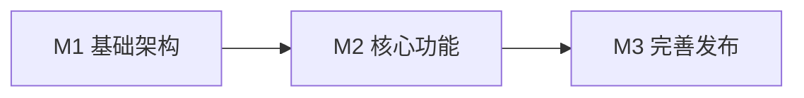

# Gemini Image Downloader - 里程碑规划

> 📅 版本：v1.0  
> 📅 创建时间：2025-12-23

---

## 里程碑概览

```
M1 基础架构        M2 核心功能        M3 完善发布
━━━━━━━━━━━━━━━━━━━━━━━━━━━━━━━━━━━━━━━━━━━━━━━━━━━→
   插件骨架           图片下载           测试优化
   内容脚本           ZIP打包            发布上线
   Popup界面          命名规则
```

---

## M1 - 基础架构（可独立完成）

**目标**：搭建 Chrome 插件基础框架，实现 Popup 界面和图片检测

**预计耗时**：1-2小时

### 交付物

| 文件 | 说明 |
|------|------|
| `manifest.json` | 插件配置文件 |
| `popup/popup.html` | Popup 界面 |
| `popup/popup.css` | Popup 样式 |
| `content/content.js` | 内容脚本（图片检测） |
| `icons/` | 插件图标 |

### 任务清单

- [ ] **T1.1** 创建项目目录结构
- [ ] **T1.2** 编写 `manifest.json`
- [ ] **T1.3** 创建 Popup HTML/CSS 界面
- [ ] **T1.4** 实现 `content.js` 图片检测逻辑
- [ ] **T1.5** 制作插件图标（16/48/128px）
- [ ] **T1.6** 本地加载测试（插件是否正常显示）

### 验收标准

- ✅ 插件可在 Chrome 中正常加载
- ✅ 点击图标可弹出 Popup 界面
- ✅ 能正确检测页面中的图片数量

---

## M2 - 核心功能（依赖 M1）

**目标**：实现图片下载、ZIP 打包和智能命名

**预计耗时**：2-3小时

### 交付物

| 文件 | 说明 |
|------|------|
| `popup/popup.js` | 下载逻辑 |
| `libs/jszip.min.js` | ZIP 打包库 |

### 任务清单

- [ ] **T2.1** 集成 JSZip 库
- [ ] **T2.2** 实现 Popup 与 Content Script 消息通信
- [ ] **T2.3** 实现获取对话标题逻辑
- [ ] **T2.4** 实现高清 URL 转换逻辑
- [ ] **T2.5** 实现图片 Fetch 下载
- [ ] **T2.6** 实现 ZIP 打包逻辑
- [ ] **T2.7** 实现文件命名规则
- [ ] **T2.8** 触发浏览器下载

### 验收标准

- ✅ 点击下载按钮可下载 ZIP 文件
- ✅ ZIP 内图片为高清版本
- ✅ 文件命名符合规则

---

## M3 - 完善发布（依赖 M2）

**目标**：处理边界情况、优化体验、准备发布

**预计耗时**：1-2小时

### 交付物

| 文件 | 说明 |
|------|------|
| 优化后的代码 | 边界处理 |
| `README.md` | 使用说明 |

### 任务清单

- [ ] **T3.1** 处理无图片情况
- [ ] **T3.2** 处理非 Gemini 页面
- [ ] **T3.3** 处理超长/特殊字符标题
- [ ] **T3.4** 添加下载状态提示（进度、完成）
- [ ] **T3.5** 处理网络错误
- [ ] **T3.6** 编写 README 使用说明
- [ ] **T3.7** 完成所有测试用例
- [ ] **T3.8** 准备 Chrome Web Store 发布（可选）

### 验收标准

- ✅ 所有测试用例通过
- ✅ 边界情况处理得当
- ✅ 用户体验流畅

---

## 里程碑依赖关系



---

## 执行建议

| 里程碑 | 可独立执行 | 说明 |
|--------|------------|------|
| **M1** | ✅ 是 | 可单独完成基础架构，验证插件框架 |
| **M2** | ⚠️ 依赖 M1 | 需要 M1 的骨架代码 |
| **M3** | ⚠️ 依赖 M2 | 需要 M2 的核心功能 |

> 💡 **建议**：按 M1 → M2 → M3 顺序执行，每个里程碑完成后进行对应测试用例验证
